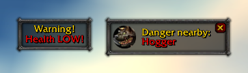
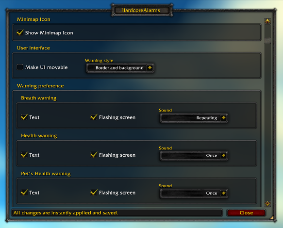
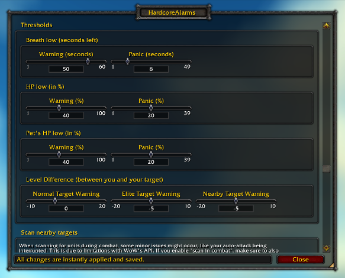

## HardcoreAlarms
A WoW(1.12 Turtle) addon. Configurable Alarms for Low HP, out of breath, dangerous quests and enemies. Primarily for hardcore characters.

Features:
* Fully configurable. Adjust and toggle all warnings. Movable warning windows.
* Can either warn by text, sound or flashing screen.
* Warns when your HP or your pet's HP is low, or when you're running out of breath.
* Warns when your hostile target is high level or elite.
* Warns when you or your hostile target are flagged for PvP.
* Warns about dangerous quests or units. Displays a helpful text that tells you what to watch out for.
* Scans the surrounding area and warns of dangerous targets.
* Click minimap icon or run '/hardcorealarms' or '/hca' to open config.
* Dismiss and/or blacklist warnings.
* List of dangerous quests/units easily extendable. More details below...

## Screenshots
Warning frames: 
 
Options UI: 

## Install
* Recommended:
    - Open your Turtle-WoW Launcher and open the "Addons" tab.
    - Click "+ Add new addon" and paste this repository's URL into the input field: https://codeberg.org/hyperhumble/HardcoreAlarms
    - Click "Install".
    - Your addon has now been installed and will receive update notifications in the Turtle-WoW Launcher.
* Manual installation (no automatic updates):
    - Download this repository by cloning it or downloading the zip ('...'-button top right) and unpacking it.
    - Copy the contents to your WoW installation folder under ./Interface/AddOns/HardcoreAlarms (Addon folder name has to be exact)
    - This, for example, is where HardcoreAlarms.toc should be now: <WoW-Install-Folder>/Interface/AddOns/HardcoreAlarms/HardcoreAlarms.toc
    - That's it. However, you'll need to update the addon manually, so don't forget to check back once in a while.

## Contribute
* This addon has been translated into German, French, Spanish, Portuguese, Korean and Taiwanese Chinese. All of these translations (except German) have been made via automatic tools and haven't been verified. If you think you can improve one of these translations, please feel free to adjust them in [./Locale.lua](./Locale.lua) and send a pull request.
* If you are aware of a certain quest or unit in WoW that you think this addon should warn about, you can quite easily add it yourself. Unfortunately there's no way in WoW 1.12 to get a proper unit or quest id via the API, so we need to work with quest titles and unit names instead. Here's how:
    1. Pick one:
       1. If it's a quest:
          - Find the quest id in one of these lists: Look first in [./pfDB/enUS/quests.lua](./pfDB/enUS/quests.lua), then in [./pfDB/enUS/quests-turtle.lua](./pfDB/enUS/quests-turtle.lua) (["D"] is description, ["O"] objectives and ["T"] titles).
          - Add it to [HardcoreAlarms.QUESTIDS#L12](./HardcoreAlarms.lua#L12) at the top of [./HardcoreAlarms.lua](./HardcoreAlarms.lua).
          - In [./Locale.lua#L47](./Locale.lua#L47) add a new localized string like this: L["QUEST_WARN_<QUEST_ID>"] (replace <QUEST_ID> with your quest id, e.g. 'L["QUEST_WARN_987"]')
       2. Else if it's a unit, that you want to warn about when the player is targeting it:
          - Find the unit id in one of these lists: Look first in [./pfDB/enUS/units.lua](./pfDB/enUS/units.lua), then in [./pfDB/enUS/units-turtle.lua](./pfDB/enUS/units-turtle.lua)
          - Add it to [HardcoreAlarms.UNITIDS#L16](./HardcoreAlarms.lua#L16) at the top of [./HardcoreAlarms.lua](./HardcoreAlarms.lua).
          - In [./Locale.lua#L20](./Locale.lua#L20) add a new localized string like this: L["TARGET_WARN_<UNIT_ID>"] (replace <UNIT_ID> with your unit id, e.g. 'L["TARGET_WARN_123"]')
       3. Else if it's a unit, that you want to repeatedly scan the surrounding area for and warn of:
          - Find the unit id in one of these lists: Look first in [./pfDB/enUS/units.lua](./pfDB/enUS/units.lua), then in [./pfDB/enUS/units-turtle.lua](./pfDB/enUS/units-turtle.lua)
          - In [./UnitscanTargets.lua](./UnitscanTargets.lua), search for the zone your unit is in. Then add the unit id under the correct zone id.
          - That's all. Skip to the last point 3.
    2.
       - Followed by ' = ' and your warning text that you want to show to the player. Use existing phrases like quest_warnescort or quest_warntightspace when applicable.
       - Please add your new warning text in all languages that you find in Locale.lua { "esES", "frFR", "deDE", "enUS", "koKR", "zhTW", "ptBR" }. Use whatever automatic translation tools you want. ChatGPT should work fine.
    3.
       - That's it. Test it in-game by actually accepting the quest or targeting the unit. If you added a quest or target-unit warning, you can also test all possible warning states by running '/hca test' and clicking 'Next test' to cycle through them.
       - Don't forget to open a pull request :)

## Thanks to
- [pfQuest](https://github.com/shagu/pfQuest-turtle) for a great lua database which makes localization of quest titles and unit names a breeze
- [unitscan-turtle-hc](https://github.com/RetroCro/unitscan-turtle-hc) for a very helpful list of dangerous targets

## License
[GPLv3](./LICENSE)

Free and open-source. Hell yeah! 
_This means you may use, modify, and distribute this project, but any changes you release must be licensed under [GPLv3](./LICENSE) and include the source code._
